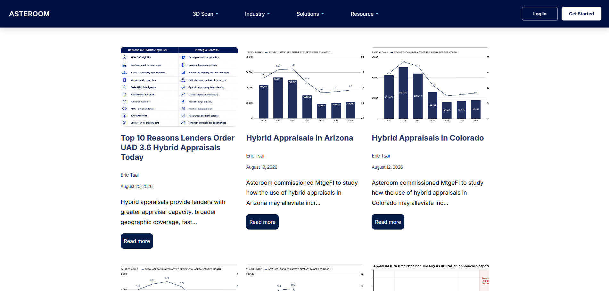
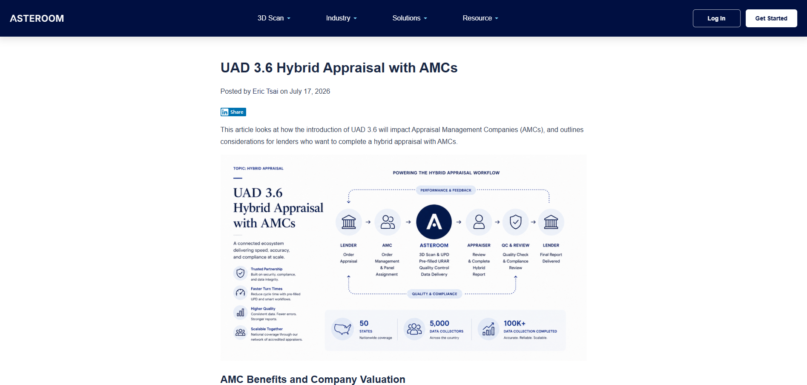
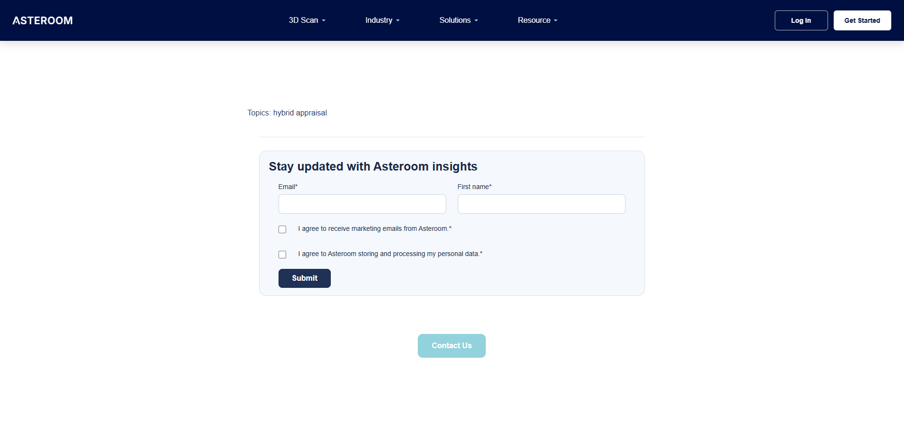
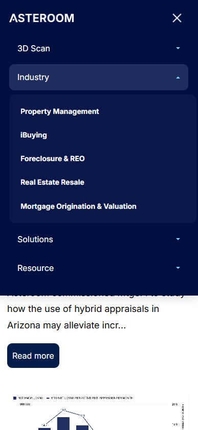
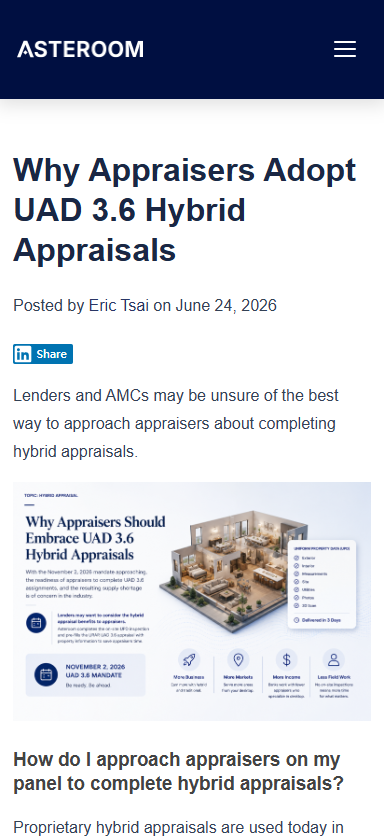
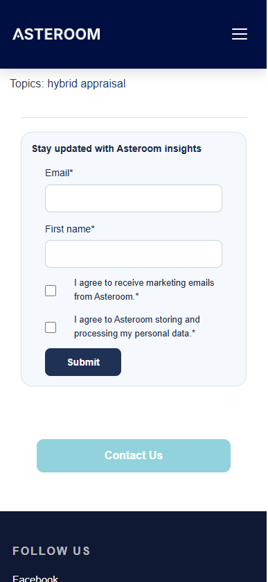

HubSpot Custom Blog UI
AI-assisted HubSpot CMS customization for a responsive, brand-aligned blog listing and post experience.
> **Portfolio Project**
>
> This repository documents a real HubSpot CMS customization project. The public version preserves the implementation architecture and front-end behavior while removing production HubSpot form identifiers and selected direct contact details.
> 
> **Overview**
> 
> The HubSpot-hosted blog needed stronger visual and UX alignment with the main brand website. Rather than styling individual pages one by one, I built a reusable template system for both the blog listing and individual > blog posts.
> 
> The implementation includes:
>     a custom HubSpot blog listing template
>     a custom HubSpot blog post template
>     reusable global header and footer partials
>     responsive desktop, tablet, and mobile navigation
>     consistent post-level UI through a shared blog post template
>     a newsletter subscription section
>     a Contact Us conversion CTA
>    brand-aligned typography, spacing, colors, buttons, and navigation
>    HubSpot-native menu, blog content, blog listing, and form components
    
> **Business Challenge**
> 
> The objective was to make the HubSpot blog feel like a coherent extension of the main website rather than a disconnected default CMS experience.
> 
> The redesigned blog needed to:
>     visually align with the existing brand website
>     maintain consistent navigation across listing and article pages
>     use reusable templates instead of page-by-page styling
>     support desktop, tablet, and mobile layouts
>     preserve HubSpot-native content management
>     add clear conversion paths through newsletter subscription and Contact Us CTAs
>     remain maintainable for future blog publishing
> 
**Solution Architecture**
```text
Blog listing template
├── HubSpot blog-posts module
├── Shared global header
├── Shared global footer
├── Shared stylesheet
├── Newsletter form
└── Contact CTA

Blog post template
├── HubSpot blog-content module
├── Shared global header
├── Shared global footer
├── Shared stylesheet
├── Newsletter form
└── Contact CTA
```
The listing and detail templates share the same header, footer, styling system, responsive navigation behavior, newsletter pattern, and conversion CTA. This creates a consistent UI across new and existing blog content without requiring each post to be manually rebuilt.
Demo

Blog Listing — Desktop
The custom listing template preserves HubSpot's native blog content while applying a branded card-based layout with consistent spacing, imagery, metadata, summaries, and Read More CTAs.


Blog Post — Desktop
Individual articles use a shared HubSpot blog post template so that navigation, typography, content width, spacing, and conversion components remain consistent across posts.


Conversion Components — Desktop
Both listing and post templates include reusable newsletter subscription and Contact Us conversion sections.


Responsive Navigation
On tablet and mobile, the desktop navigation is replaced by a collapsible menu with expandable multi-level navigation.


Blog Post — Mobile
The shared post template adapts content width, typography, navigation, spacing, and media presentation for smaller screens.



Conversion Components — Mobile
The newsletter form and Contact Us CTA are also adapted for mobile layouts.


Additional desktop and mobile screenshots are available in the `screenshots/` directory.

**Responsive UI Implementation**

The shared stylesheet includes distinct responsive behavior for desktop, tablet, and mobile layouts.

Key implementation areas include:
    fixed branded header
    desktop multi-level navigation
    mobile/tablet hamburger navigation
    expandable mobile submenus
    responsive footer grids
    blog listing card layout
    responsive image sizing
    newsletter form layouts
    mobile-first Contact Us CTA treatment
    The mobile navigation also resets submenu state when the viewport returns to desktop size.
    Reusable HubSpot Components
    
The project preserves HubSpot-native CMS functionality rather than replacing it with a separate content system.
The templates use:
    `@hubspot/blog_posts`
    `@hubspot/blog_content`
    `@hubspot/menu`
    `standard_header_includes`
    `standard_footer_includes`

**HubSpot Forms embed**
The header and footer are implemented as reusable HubSpot global partials and referenced by both the blog listing and blog post templates.

**Conversion Design**
The blog experience includes two reusable conversion paths.

**Newsletter Subscription**
A HubSpot form is embedded in both listing and detail templates and styled to match the surrounding blog interface.

The responsive form treatment includes:
    email and first-name fields
    marketing consent checkboxes
    desktop two-column field layout
    stacked mobile form layout
    branded submit button styling
    Contact Us CTA
A consistent Contact Us CTA appears after the blog content and subscription section.

On smaller screens, the CTA expands into a larger touch-friendly button while remaining visually aligned with the desktop design.

**AI-Assisted Development**
HubSpot's built-in AI was used as a development accelerator during code generation, iteration, and troubleshooting.

**My role included:**
    identifying the UX and brand-alignment requirements
    defining responsive behavior across desktop, tablet, and mobile
    specifying listing, article, header, footer, form, and CTA behavior
    evaluating generated implementation options
    validating and refining AI-generated code
    troubleshooting issues inside HubSpot's code editor
    testing responsive navigation and layout behavior
    maintaining consistency across blog posts through reusable templates
    deciding when generated output was acceptable for publishing
    AI accelerated implementation, but requirements, acceptance criteria, QA, refinement, and publishing decisions remained human-led.

**Key Implementation Decisions**

Reusable Template System

The project uses one listing template and one blog post template instead of modifying individual posts separately.
This makes the blog easier to maintain and ensures that new posts inherit the same UI structure.

Shared Global Partials

The branded header and footer are separated into reusable global partials:
`asteroom-site-header.html`
`asteroom-site-footer.html`
Both listing and post templates include these shared components.

Shared Styling Layer

A single shared stylesheet controls:
    blog content typography
    fixed header behavior
    desktop and mobile navigation
    buttons
    footer layout
    listing cards
    newsletter forms
    Contact Us CTA
    responsive breakpoints

HubSpot-Native Content Modules

The solution keeps HubSpot's own blog, menu, and form functionality intact. The customization focuses on presentation, interaction, consistency, and conversion flow rather than replacing HubSpot's content model.

Repository Structure
```text
HubSpot-Custom-Blog-UI/
├── README.md
├── docs/
│   └── dependency-map.md
├── screenshots/
│   ├── 01-blog-listing-desktop.png
│   ├── 02-blog-listing-conversion-section-desktop.png
│   ├── 03-blog-footer-desktop.png
│   ├── 04-blog-post-desktop.png
│   ├── 05-blog-post-conversion-section-desktop.png
│   ├── 06-blog-listing-conversion-section-mobile.png
│   ├── 07-blog-footer-mobile.png
│   ├── 08-mobile-navigation-expanded.png
│   ├── 09-blog-post-mobile.png
│   ├── 10-blog-post-conversion-section-mobile.png
│   └── 11-mobile-navigation-and-footer.png
└── src/
    ├── partials/
    │   ├── asteroom-site-header.html
    │   └── asteroom-site-footer.html
    ├── styles/
    │   └── asteroom-blog-header-footer.css
    └── templates/
        ├── asteroom-blog-listing-custom.html
        └── asteroom-elevate-blog-detail.html
```
Dependency Map
A simplified dependency map is available in:
`docs/dependency-map.md`
At a high level:
```text
Blog listing template
├── Shared stylesheet
├── Shared global header
│   └── HubSpot menu module
├── HubSpot blog-posts module
├── HubSpot form embed
└── Shared global footer

Blog post template
├── Shared stylesheet
├── Shared global header
│   └── HubSpot menu module
├── HubSpot blog-content module
├── HubSpot form embed
└── Shared global footer
```
Portfolio Scope
This repository is a code snapshot and portfolio case study, not a deployable standalone website.
The templates depend on HubSpot CMS modules, HubL, runtime includes, menu configuration, form configuration, and other HubSpot-managed resources.
The repository is intended to demonstrate:
CMS customization
reusable template design
responsive UI implementation
conversion-oriented blog UX
HubSpot front-end integration
AI-assisted development and QA
Privacy and Configuration
Production HubSpot portal and form identifiers have been replaced with placeholders in the public source version.
Selected direct contact and social details have also been neutralized where they are not necessary to demonstrate the implementation.
The private production snapshot is maintained separately and is not included in this public repository.
Potential Improvements
Potential future enhancements include:
centralizing repeated navigation behavior into one shared script
reducing duplicate inline JavaScript between listing and detail templates
moving form configuration into a more maintainable configuration layer where supported
simplifying CSS overrides and reducing `!important` usage where feasible
adding structured cross-device regression testing
separating shared JavaScript into a dedicated asset if the project expands further
These are presented as potential improvements rather than functionality claimed by the current implementation.
Disclaimer
This project is presented as a portfolio case study of a real HubSpot CMS customization.
The public repository preserves the implementation approach while excluding selected production configuration and private administrative information.
